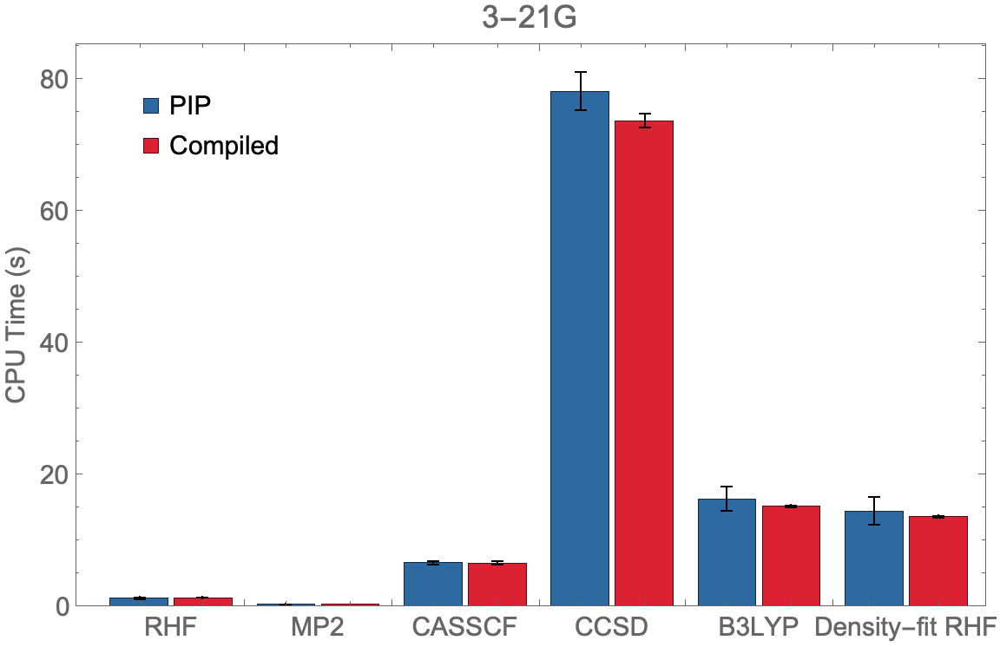
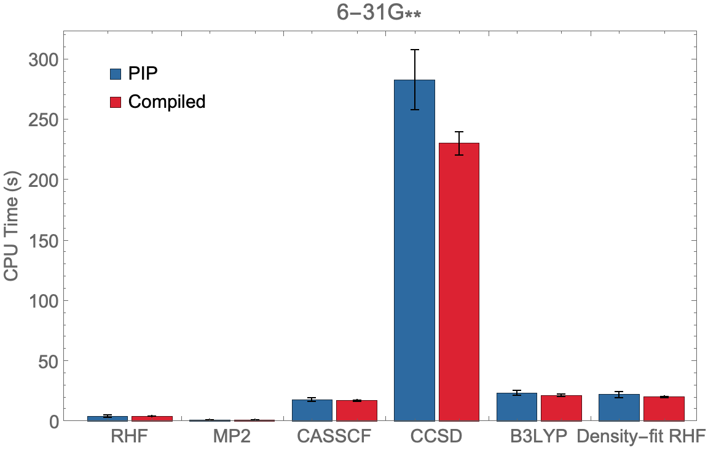
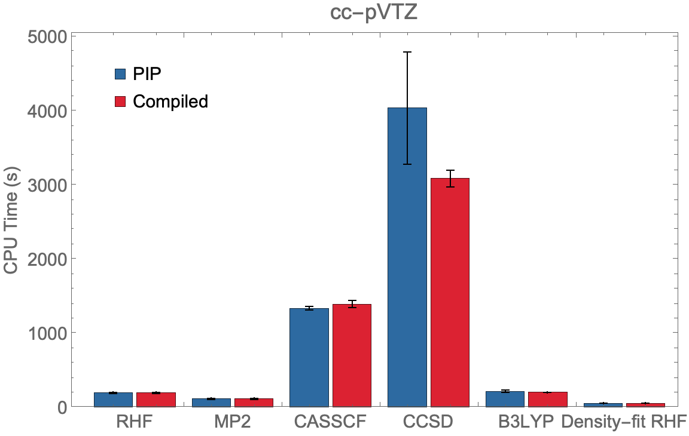
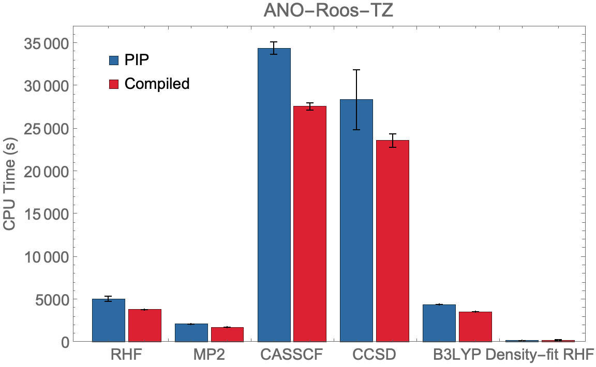

# PySCF Performance Benchmark
{: .no_toc}

Useful commands and tutorials about installation and use of PySCF.
{: .fs-6 .fw-300 }

---
## Table of contents
{: .no_toc .text-delta }

1. TOC
{:toc}

---

## PySCF Performance Benchmark

Compiled versions of PySCF can be more efficient for highly computational demanded calculations and *should be preferred* over PIP/Conda installations.
```
Benchmarking procedure from PySCF Examples: Benzene Molecule

model name : Intel (R) Xeon (R) Gold 6136 CPU@3.00 GHz
MemTotal : 394662840 kB
OMP_NUM_THREADS = 12
```

|  |  |
|  |  |

To run compiled PySCF, follow [this procedure]({{ site.baseurl }}#running-compiled-pyscf).
